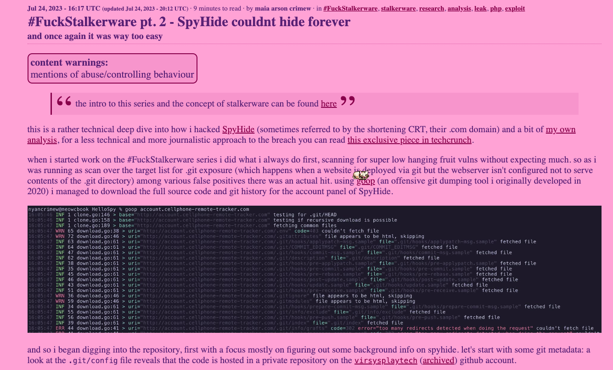
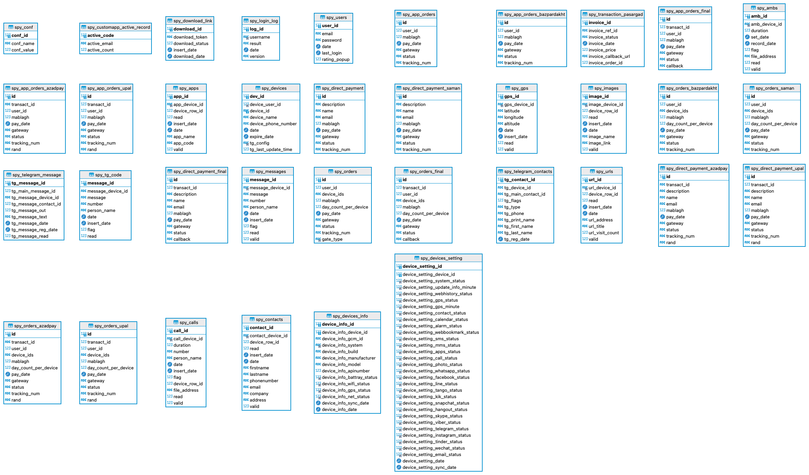

# SpyHide-Report – eine Recherche zu einer iranischen StalkerWare 
## Abstract
SpyHide was a stalkerware from Iran. It was hacked by a hacktivist in 2023. This article looks at this stalkerware, how it worked and who was behind it. The report is aimed at a technically interested audience and is intended to facilitate further investigations. The research served as a basis for [this article for the Swiss Newspaper «Neue Zürcher Zeitung»](https://www.nzz.ch/meinung/es-braucht-einen-richtungsentscheid-ld.1777119).

## Introduction 
Stalkerware or spouseware are surveillance apps that can be bought for just a few dollars. Technologically, they are not comparable with products from state actors. They are simpler in design and hardly exploit any gaps in smartphones. The surveillance operator needs access to the target's smartphone in order to install the app. And that is what makes them so dangerous: warnings on the mobile phone can be clicked away by the perpetrator, and security measures and malware scanners can even be deactivated.  

Many providers position their app in the parent-child market ("parenting control"). The app is supposed to be used to monitor the child's mobile phone use. In reality, however, the app is used by others: people who want to monitor their nearest and dearest, usually their partner. 

In 2023, a major provider from Iran was hacked by the Swiss hacktivist [maia arson crimew](https://maia.crimew.gay/) (lower case according to maia). The data was published on the hacktivist platform DDOS Secrets for journalists and scientists. 

It is recommended to read [maia's analysis first](https://maia.crimew.gay/posts/fuckstalkerware-2/).

## The attack

maia calls her series of articles "#FuckStalkerware". She writes about StalkerWare providers whose data is leaked to her or she herself is attacked. In 2023, SpyHide became her target. Her [blog post](https://maia.crimew.gay/posts/fuckstalkerware-2/) explains how she went about it. She describes it as surprisingly simple. In a nutshell, SpyHide had two vulnerabilities: 

1. **git exposure**: the makers of SpyHide copied the git directory (.git) to the server. This allowed maia to access the source code and analyse it for further vulnerabilities 
2. **image upload**: he spyware can transfer images from the target device to the control server. This receives the image and saves it to the file system without checking the file format. A reverse shell could thus be infiltrated via the API of the control server, allowing access to the entire server. 

## What data is available? 

The data published by Maia at DDOS-Secrets contains: 

* The backend of SpyHide, written in PHP 
* MySQL/MariaDB databases of the backend and old backups of them 
* Wordpress instances of the sales website and associated databases 
* Images copied from target devices 
* Phone recordings from target devices (but the data is corrupt) 
* Microphone recordings from target devices 

Images and audio recordings from target devices are deleted by SpyHide itself after some time. According to the SpyHide backend after three months. However, the metadata remains in the database. SMS messages were also deleted. However, a backup copy from 2019 extends the database by a few more years. 

## Data insights 

SpyHide operated with two databases: `admin_spyhide` (first login 2015-08-14) and `admin_spyhidetempbackup23` (first login: 2016-11-01). Even though the structure of the databases is identical, they contain different and both current data. When logging in, the control server first checks the password on the first database. If the login fails, the credentials are tried on the second database. From mid-2018, new users were only registered on the newer database `spyhidetempbackup23`. `admin_spyhide` remained active, however, with the last logins dating from 13 July 2023. 

Presumably two SpyHide offshoots were initially operated: One for the Iranian market, one for the international market. This is indicated by different domains (more on this later). It is not known why the data was never merged. 

The two databases show that 
* **96,462 devices** were monitored 
* **857,694 users** have registered. Only very few of them paid. 
* **3.3 million SMS messages** were recorded 
* **1.9 million GPS coordinates** stored 
* **1.2 million calls** recorded 
* **380,000 images** copied 

The databases receive various information on payments. It appears that the payment provider was changed several times. Payment data mainly ends up in the `spy_orders` and `spy_direct_payment` tables. Adding up all verified payments ("verified" status), SpyHide has collected 717,202 dollars. This does not include payments in Iranian riyals. Its exchange rate is so low that these payments - despite their large number - are not significant.

## Hands-on: What SpyHide can do, what it looks like 
The control server can be restored with a little effort - even if the source code is chaotic and has redundancies. SpyHide collects: 

* general mobile phone data (operating system, settings, etc.) 
* GPS history 
* SMS Messages
* calls and the option to record them 
* photos 
* contacts 
* installed apps 
* background recordings ("Ambient") of 1 - 5 minutes. 
* Browsing history (but to a limited extent) 

Rooted devices can also collect the following according to the backend: WhatsApp, Facebook, Hangouts, Skype, Line, KiK, Viber, ChatOn and Gmail. However, there is no table in the database for any of these services. This was probably just an empty promise. The developers also seem to have experimented with Telegram. The database contains Telegram messages between March 2015 and February 2016 from 15 different devices. Most of the messages are in Persian. It is quite possible that the creators monitored themselves for testing purposes. 

The backend for customers is relatively simple. The active devices and their status are displayed in an overview. The SpyWare can be downloaded directly from there as an APK. The individual tabs show further information on the collected data. See the Bidler gallery. 

// Gallery

    <figure>
        
        <figcaption>Image 1</figcaption>
    </figure>
    <figure>
        <a href="images/dbschema.png">
        <figcaption>Image 2</figcaption></a>
    </figure>

