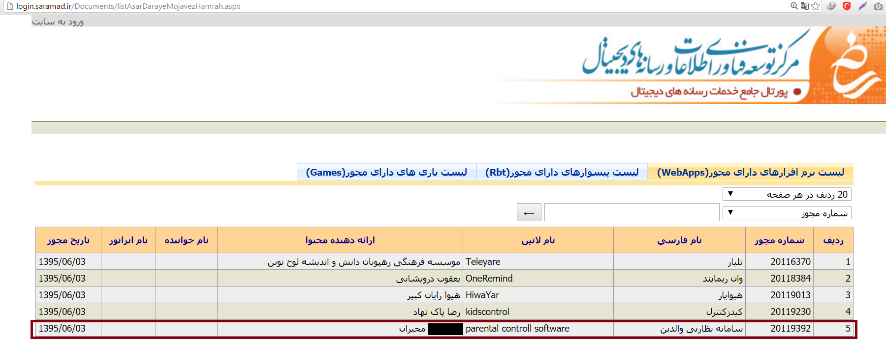
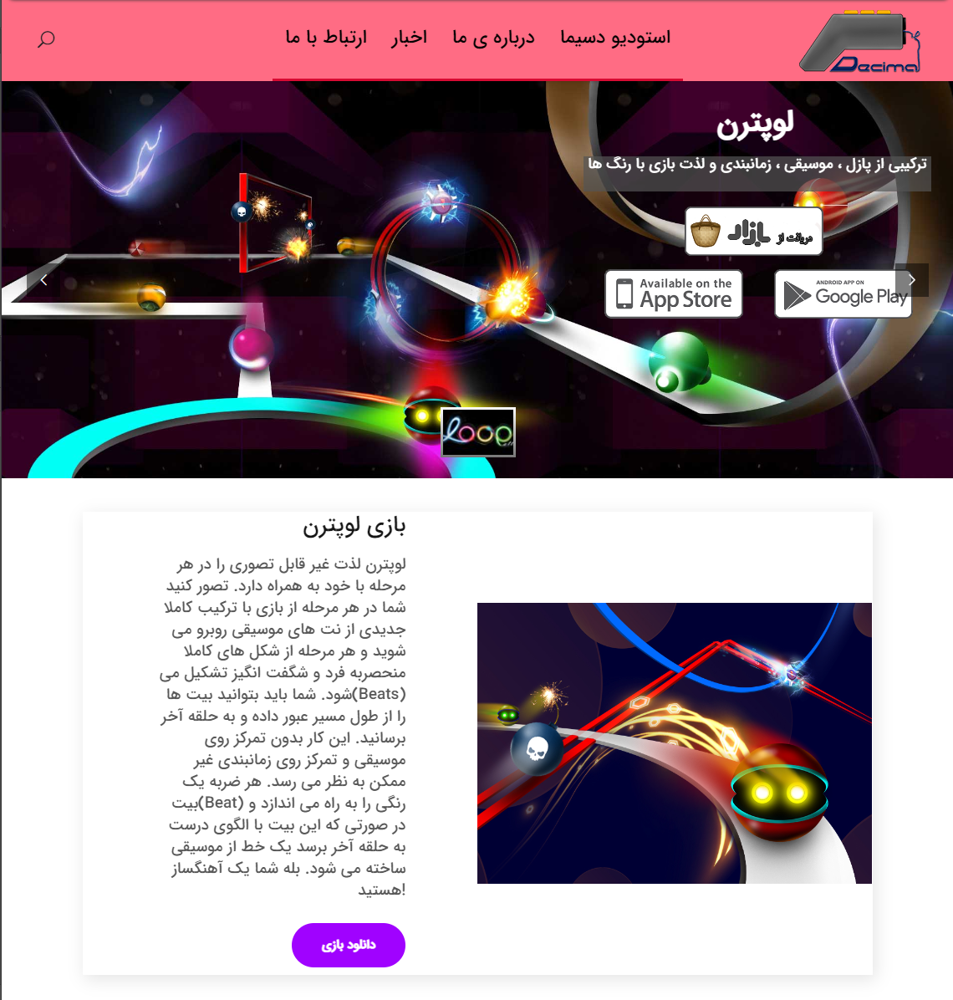

*Illustration by Jonas Oesch / NZZ*

# SpyHide-Report: a research on an Iranian stalkerware
## Abstract
SpyHide was a stalkerware from Iran. It was hacked by a hacktivist in 2023. This article looks at this stalkerware, how it worked and who was behind it. The report is aimed at a technically interested audience and is intended to facilitate further investigations. The research served as a basis for [this article in the Swiss Newspaper «Neue Zürcher Zeitung»](https://www.nzz.ch/gesellschaft/wenn-der-schatz-auf-handy-mitliest-wie-eine-schweizerin-von-ihrem-partner-mit-iranischer-spyware-ausspioniert-wurde-ld.1775351).

## Introduction 
Stalkerware or spouseware are surveillance apps that can be bought for just a few dollars. Technologically, they are not comparable with products from state actors. They are simpler in design and hardly exploit any gaps in smartphones. The surveillance operator needs access to the target's smartphone in order to install the app. And that is what makes them so dangerous: warnings on the mobile phone can be clicked away by the perpetrator, and security measures and malware scanners can even be deactivated.  

Many providers position their app in the parent-child market («parenting control»). The app is supposed to be used to monitor the child's mobile phone use. In reality, however, the app is used by others: people who want to monitor their nearest and dearest, usually their partner. 

In 2023, a major provider from Iran was hacked by the Swiss hacktivist [maia arson crimew](https://maia.crimew.gay/) (lower case according to maia). The data was published on the hacktivist platform DDoSecrets for journalists and scientists. 

It is recommended to read [maia's analysis first](https://maia.crimew.gay/posts/fuckstalkerware-2/).

## The attack

maia calls her series of articles `#FuckStalkerware`. In these articles she writes about different StalkerWare and their data. The data is made available to her, or she attacks the manufacturers herself. In 2023, SpyHide became her target. Her [blog post](https://maia.crimew.gay/posts/fuckstalkerware-2/) explains how she proceeded. She describes it as surprisingly simple. In a nutshell, SpyHide had two vulnerabilities: 

1. **git exposure**: the makers of SpyHide copied the git directory (.git) to the server. This allowed maia to access the source code and analyse it for further vulnerabilities 
2. **image upload**: he spyware can transfer images from the target device to the control server. This receives the image and saves it to the file system without checking the file format. A reverse shell could thus be infiltrated via the API of the control server, allowing access to the entire server. 


*Screenshot of maias [blog post](https://maia.crimew.gay/posts/fuckstalkerware-2/)*

## What data is available? 
The data published by maia at DDoSecrets contains data from 2015 to 2023: 

* The backend of SpyHide, written in PHP 
* MySQL/MariaDB databases of the backend and old backups of them 
* Wordpress instances of the sales website and associated databases 
* Images copied from target devices 
* Phone recordings from target devices (but the data is corrupt) 
* Microphone recordings from target devices 

Images and audio recordings from target devices are deleted by SpyHide itself after some time. According to the SpyHide backend after three months. However, the metadata remains in the database. SMS messages were also deleted. However, a backup copy from 2019 extends the database by a few more years. 


*The database schema of the SpyHide backend*

## Data insights 
SpyHide operated with two databases: `admin_spyhide` (first login 2015-08-14) and `admin_spyhidetempbackup23` (first login: 2016-11-01). Even though the structure of the databases is identical, they contain different and both current data. When logging in, the control server first checks the password on the first database. If the login fails, the credentials are tried on the second database. From mid-2018, new users were only registered on the newer database `spyhidetempbackup23`. `admin_spyhide` remained active, however, with the last logins dating from 13 July 2023. 

Presumably two SpyHide offshoots were initially operated: One for the Iranian market, one for the international market. This is indicated by different domains (more on this later). It is not known why the data was never merged. 

The two databases show that 
* **96,462 devices** were monitored 
* **857,694 users** have registered. Only very few of them paid. 
* **3.3 million SMS messages** were recorded 
* **1.9 million GPS coordinates** stored 
* **1.2 million calls** recorded 
* **380,000 images** copied 

The databases receive various information on payments. It appears that the payment provider was changed several times. Payment data mainly ends up in the `spy_orders` and `spy_direct_payment` tables. Adding up all verified payments (`verified` status), SpyHide has collected 717,202 dollars. This does not include payments in Iranian riyals. Its exchange rate is so low that these payments - despite their large number - are not significant.

## Hands-on: What SpyHide can do, what it looks like 
The control server can be restored with a little effort - even if the source code is chaotic and has redundancies. SpyHide collects: 

* **general mobile phone data** (operating system, settings, etc.) 
* **GPS** history 
* **SMS** Messages
* **calls** and the option to record them 
* **photos** 
* a list of all **contacts** 
* a list of installed **apps** 
* **background recordings** («Ambient») of 1 - 5 minutes. 
* Browsing **history** (but to a limited extent) 

Rooted devices can also collect the following according to the backend: WhatsApp, Facebook, Hangouts, Skype, Line, KiK, Viber, ChatOn and Gmail. However, there is no table in the database for any of these services. This was probably just an empty promise. The developers also seem to have experimented with Telegram. The database contains Telegram messages between March 2015 and February 2016 from 15 different devices. Most of the messages are in Persian. It is quite possible that the creators monitored themselves for testing purposes. 

The backend for customers is relatively simple. The active devices and their status are displayed in an overview. The SpyWare can be downloaded directly from there as an APK. The individual tabs show further information on the collected data. See the screenshots. 

</img> </img> </img> </img> </img> </img> 

# The App and the myth of remote installation
[In a cinematic trailer](https://www.youtube.com/watch?v=1N98WJrZ2Yk), SpyHide claims that the SpyWare can be installed without physical contact. This is strongly questioned. 

SpyHide offers two apps. The conventional app is installed on the target device by the attacker himself. As of August 2020, the app has been extended so that it can be installed by the victim themselves. For this purpose, the website *tesla-ringtone.site* was launched as a front. The attacker is supposed to encourage the target to download a ringtone app there. After installation, the app requests an activation code, which is provided by the attacker and connects the target device to his account. SpyHide described the app as follows:

> «Spyhide remote tracker app is in fact a Ringtone Creator application, but within that is embedded  Spyhide tracking application, the tracker app is completely hidden in Ringtone Creator application, so that you can introduce this application as a professional Ringtone Creator to your target person and encourage him/her to install this application on his/her cell phone.»


*Screenshot of tesla-ringtone.site*

This probably did not work. Even old Android devices warn of a «virus» several times. In order to be able to install third-party apps at all, the security settings of the mobile phone must also be changed. All possible authorisations are also requested during installation. It takes a lot of good faith to install this app.

</img> 
</img>
</img>
</img>
</img>
</img>
</img>
</img>
</img>
</img>

As soon as the activation code has been entered, the app icon disappears from the home screen. The app also changes its name to `com.wifisettings.editor`. The app logs on to the server via POST request using the address http://virsis.net/client/scripts/service_new.php (more on Virsis later). The server is now offline.
```json
{  
    "action": "createCustomAccount",  
    "deviceId": "861349103823194",  
    "deviceName": "HONOR FRD-L09",  
    "devicePhone": " ",  
    "password": "183251",  
    "tempCharge": "custom",  
    "username": "183251"  
 } 
```

The app can be opened on target devices by calling the number `#3333*` or `#3838*`.

## A StalkerWare is created: From SpyHide to Virsis
The story of SpyHide begins sometime in 2015, when Mohammad A. works as a developer for a company that creates websites and apps. It is not known when he decided to focus on spyware. The following dates are verified. It is not always necessarily the date of registration, but can also be the date when the entry was captured by crawlers. 
|<div style="width:110px">Date&nbsp;&nbsp;&nbsp;&nbsp;&nbsp;&nbsp;&nbsp;&nbsp;&nbsp;&nbsp;&nbsp;&nbsp;&nbsp;&nbsp;</div>|Action|
|:-------------|:--|
|2015-07-09|**spyhide.com**<br /> Mohammad A. registers spyhide.com in his name and address. IP: `88.198.136.80`|
|2015-08-14|**Oldest entry in the database**<br />First (test) entry in the database (user `mojmadah@yahoo.com.ollllllllllllld`, password `123456`)|
|2015-09-17|**virsis.net**<br />Virsis.net is registered by Mohammad A.. Virsis offers services for search engine optimisation, web design and app development. However, the control server runs on the Virsis server until 2023. Whether the company has ever offered legitimate work is questionable. No former employees could be found. |
|2016-02-17/<br />2016-02-18|**Relocation to Germany**<br />Spyhide.com and virsis.net move to Germany to a server of the company [Hetzner](https://www.hetzner.com/) (`144.76.1.163`). SpyHide will remain there until Hetzner blocks it in 2023. |
|2016-03-20|**spyhide.ir**<br />The Iranian domain of SpyHide is registered. It also points to the German server.|
|2016-03-28|**Obfuscation**<br />Spyhide.com is obfuscated, Mohammeds name disappears. New email address: spyhide.com@gmail.com|
|2016-06-23|**More domains**<br />Mohammed A. registers further domains in his name. Most do not remain active for long:<br />`best-mobile-tracker.ir`, `android-tracker.ir`, `Bestcellphonetracker.ir`, `firstme.ir`, `Netvaght.ir`, `Spycellphone.ir` 
|2016-08-05|**A new person appears: Mostafa M.**<br />The whois entry of Virsis.net is changed to Mostafa M. His name appears a little later as the Wordpress login of Virsis (username `mosimoji`)|
|2016-11-01|**Second database**<br />SpyHide gets a second database. From now on these run in parallel.|
|2016-11-16|**cellphone-remote-tracker.com**<br />This domain is registered and remains active until 2023.|
|2016-12-28|**Ahmed K. K.** <br />A new name appears: ahmed***@gmail.com logs into the control server as a user. His email address will appear later in the payment interface.|
|2017-05-01|**Mostafa M. takes over spyhide.ir**<br />The Whois entry of Spyhide.ir is also changed to Mostafa M.|
|2017-12-15|**android-tracker.ir changes hands**<br />Amir A. F. takes over the domain. [Underspy](https://web.archive.org/web/20180902155342/https://underspy.org/ ), a spyware that appears to have nothing to do with SpyHide, runs on the same server.|
|2018-01-18|**Virsis.net supposedly goes offline**<br />The web design company virsis.net no longer seems to exist, an error message appears. However, this message is fake, it is an HTML page designed to simulate a non-existent server. The backend still runs via this domain.|
|2020-08-25|**Tesla-ringtone**<br />In the Corona year, tesla-ringtone.site is registered and the new app is announced.|
|2023-07-13|**Last login**<br />Spyhide.com is hacked. The site then goes offline - but only for a short time.|
|2023-07-26|**Hello oospy.com**<br />SpyHide undergoes a rebranding. It is now called oospy.com and focuses on parenting control. Payments are now made to a person with the same surname as Mohammed. The website only remains online for a short time, Hetzner blocks it following a tip-off [from maia and Techcrunch](https://techcrunch.com/2023/10/05/spyhide-oospy-hacked-phone-spyware-shuts-down).|

# SpyHide and HelloSpy - two stalkerwares, one origin? 
HelloSpy («helloSPY» in own spelling) was a spyware with similar functions to SpyHide. First appearing in 2012, it disappeared sometime at the end of 2019, probably due to a data breach (see [this article by netzpolitik.org](https://netzpolitik.org/2019/spyware-company-leaves-private-customer-data-on-the-internet/)). It attracted attention because of its dubious promotional videos featuring a [female boxer](https://www.youtube.com/watch?v=x43HNXdAt8o) or an [Irishman](https://www.youtube.com/watch?v=BBjysYdnIMM). It was developed by John Nguyen. SpyHide and HelloSpy are related, even if there is still much to be discovered about this connection. 

In the database for SpyHide's WordPress site, there are various posts (`wp_posts`) with texts about Hellospy that are no longer visible. «You will need access to your iPhone at least the first time you install HelloSPY.» The email address contact@hellospy.com is also referenced. 

A user estaki@hellospy.com has made various payments to SpyHide. His email address was blacklisted in the backend code. 

A reverse-engineering of the SpyHide android app also reveals references to HelloSpy. The app can download the ffmpeg programme library from `http://hellospy.com/downloads/ffmpeg`. There are also old references to `flushdata3.hellospy.com`. In logbock.xml, the data storage location is defined as `com.hellospy.system`.
The app's SQLite database also contains old references to a Vietnamese news portal, visible only with a hex editor. 


*References in the SpyHide app to helloSPY*

SpyHide may have been developed on the basis of HelloSpy. Whether the source code was purchased or obtained elsewhere remains unclear. 

John Nguyen did not respond to enquiries.

## The people behind SpyHide
### Mohammad (Mojtaba) A. 
He is presumably the creater of SpyHide. Evidence to support this finding:  

* Various domains were registered to his email address. 
* His email address appears in the WordPress login 
* His email address appears in the app's source code.  
* Most of the Git pushes were made to his email address 
* Virsis' GitHub account was in his name and identified him as the CEO of Decima Tech - a company he also founded. The entry has since been changed, but [can be found in the internet archive](https://web.archive.org/web/20230713150318/https://github.com/virsysplaytech/ ). 
* There are also old Telegram chats with references to him 
* There are connections between Mohammed A. via his company DecimaStudio to a suspected money mule in the Netherlands. 
* When SpyHide was formed into oospy after the hacker attack, a person with the same surname was registered as a PayPal account. 

Not much is known about his motives. His LinkedIn profile states that he is a software developer from the Iranian city of Mashhad and likes tennis. The city of Mashhad appears again and again in the research. When asked, he himself initially said that he had never heard of SpyHide, but later changed his statement. He had once done something very small, but couldn't remember much about it. 

### Excursus: DecimaGroup - Mohammed A.'s side businesses 
SpyHide does not appear to be Mohammed M.'s only dubious business. His «DecimaGroup» was created around 2020. The domain decimagroup.ir was registered in his name in June with the address `blv mofateh - mofateh 6 - plak 397, mashhad, khorasan razavi, IR`. Various service providers are summarised under the group of companies. DecimaPay was designed to facilitate the transfer of money to Iran. DecimaOrder focussed on the import of goods. The company's aim was to circumvent international sanctions. This is what [it said on decimapay.ir](https://web.archive.org/web/20221120010454/https://decimapay.ir/):

 > «Decima Technology Company, by employing expert forces in the field of foreign exchange payments and providing services such as buying from foreign stores with PayPal accounts and credit cards as well as other payment systems, has been able to remove the restrictions that Iranians have in purchasing from websites and stores to solve the problems of foreign internet due to sanctions.» 

Another offshoot of the DecimaGroup was DecimaStudio. This company developed games for Android. More on this later.  

The side business did not appear to be successful and DecimaGroup and its subcontractors disappeared after a few years.

### Mostafa M. (mosimoji) 
Mostafa M has been appearing more frequently since 2016. He took over the WHOIS entries of virsis.net and spyhide.ir. He also has a login for the various WordPress sites (username `mosimoji`). Mostafa M. [has registered SpyHide in an official Iranian register](https://web.archive.org/web/20170606120133/http://spyhide.ir/wp-content/uploads/2016/08/saramad-mojavez-app.png) as «parental control software». He also appears to live in Mashhad. His exact tasks are unknown. Test data from 2015, which Mohammed A. presumably used to monitor his mobile phone, contains text messages from a Mostafa. If this is the same person, the collaboration has taken place from the very beginning. 

Mostafa M. did not respond to enquiries. 


*SpyHide entry in an iranian register*


*English translation*

## How does the money get to Iran? Money Mules in Europe

Iran is subject to sanctions and very few credit card providers allow payments to the Islamic Republic. PayPal does not operate in Iran either. SpyHide therefore needs Western accounts in order to sell its services. Money mules are used for this purpose. There are various references to such money mules in the payment interface (`Account/banking/Paypal.php`). 

### Ahmed K. K.
His e-mail address (ahmed***@gmail.com) is listed in the Paypall interface, but this line of code is commented out. Perhaps it was only inserted for test purposes. The SpyHide database contains logins to this email address between December 2016 and August 2017. He was probably active during these years. 

He did not respond to requests.

### Michael (Michaël) and Hamed A. 
When SpyHide 2023 was hacked, Paypal was running on the email address mich***@gmail.com (or mich***_api1.gmail.com). The LinkedIn profile linked to this email address shows a self-employed data analyst from Utrecht in the Netherlands. He also studied there. 

Hamed A. was also visible in the payment interface but not active. He also lives in Utrecht at the same address. The two may be brothers. Hamed also works in IT.

There is another link between Mohammed M. from Iran and Michael A. from Utrecht: DecimaStudio, a company that also belongs to Mohammed A.'s DecimaGroup. This company claims to have developed games for Android. Loopattern was the only game for a long time and is no longer available in the Google Play Store. It is still available on alternative app stores. Developer mentioned: «Michael A.».

In December 2023, a new game was released under DecimaStudio's Google account: [Knockout](https://play.google.com/store/apps/details?id=com.decimatech.healingmojo.davaa&hl=de&gl=US). The company logo on the Playstore is identical to the company logo on the company website, which can be found [in the internet archive](https://web.archive.org/web/20200323070124/http://decimastudio.ir/). An address in Utrecht is given. Hamid A. and Michael A. are also registered at the same address. It looks like Michael from Utrecht is developing these games and publishing them via Mohammed A.'s Google Play account.

The intention behind these games and whether they contain malware has not been investigated. 

</img> 
</img>
*Left: DecimaStudio website (source: InternetArchive). Right: Google Play Store. Both companies have the same logo.*

## Potential further research and unanswered questions 
Below is some more or less unstructured information that could be of importance. 

### What is/was EKMagic? 
EKMagic was an Iranian online shop for magic products. There are chat messages between the operator and Mostafa. There is also a login for EKMagic on the SpyHide WordPress page. The first SpyHide SpyApp internally [had the name `Virsys-EKMagic`](https://www.amazon.com.au/Virsys-EKMagic/dp/B01F3S3CKS). The connection between the magic shop and SpyHide remains unclear. 

There are also other Wordpress logins that could not be broken down: 
* mna****@gmail.com (registered to Mohamad N.)  
* ekmagic.ir@gmail.com
* aliexpress.razavi@gmail.com  
* ekmagicshop@gmail.com

### Blacklist e-mail addresses 

The control panel contains a detailed list of over 400 blacklisted e-mail addresses (variable `$blacklist_iranian_custom`). Whether this blacklist worked and when it took effect was not investigated, but why these people ended up on the list could prove interesting. We have written to several addresses but have not received a reply. HelloSpy (`estaki@hellospy.com`) also appears on this blacklist.

### Old log entries 
A folder called `mydata` contains JSON data as sent to the server by the SpyHide app. There are some indications that this data originates from the developers' devices. A conversation between Mohammed A. and a customer about the (untimely) delivery of software. The messages are in Persian and have not been analysed in detail.

### Domains associated with SpyHide or its creators
* spyhide.com 
* spyhide.ir 
* virsis.net 
* best-mobile-tracker.ir  
* cellphone-remote-tracker.com 
* tesla-ringtone.site 
* android-tracker.ir  
* bestcellphonetracker.ir  
* firstme.ir  
* netvaght.ir  
* spycellphone.ir 
* oospy.com 
* decimastudio.ir
* decimepay.ir 
* decimagroup.ir 
* decimaorder.ir 
* decimeerp.ir 

## Author of this report
The author of this report is a journalist from Switzerland with an background in IT, working for the Swiss newspaper [«Neue Zürcher Zeitung»](https://www.nzz.ch/). Contact him at simon.huwiler [-at-] nzz.ch